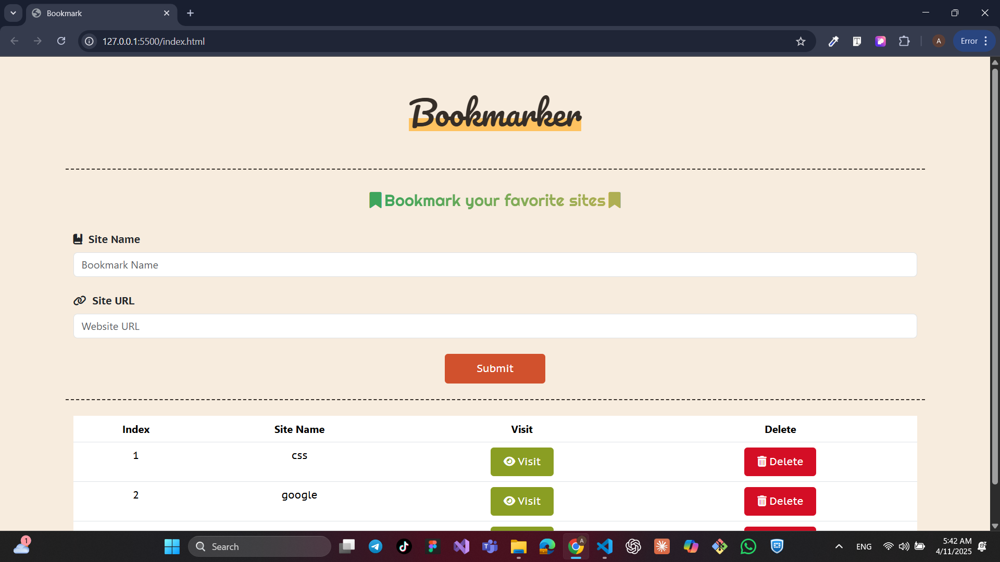

# 🔖 Bookmarker App

A simple and elegant **bookmark manager** web app built with **HTML**, **CSS**, and **Vanilla JavaScript**. It allows users to add, view, and delete bookmarks with form validation and local data storage.

## 📌 Features

- ✅ Add bookmarks with name and URL
- ✅ Real-time input validation using regular expressions
- ✅ Display bookmarks in a dynamic HTML table
- ✅ Open websites in a new tab directly from the app
- ✅ Delete bookmarks easily
- ✅ Save data to `localStorage` for persistence
- ✅ Pop-up warning for invalid input

## 🧪 Validation Rules

- **Site Name** must contain at least 3 characters and start with a letter.
- **Site URL** must be a valid format (with or without `https://`, and must contain a domain like `.com`, `.net`, etc.)

Example valid URLs:
- `https://www.example.com`
- `www.example.com`
- `example.com/page`

## 💾 Technologies Used

- HTML5
- CSS3
- Bootstrap 5
- Font Awesome
- JavaScript (DOM Manipulation + localStorage)

## 📷 Preview

 

## 🚀 Getting Started Live Demo
https://ahmedsayed26.github.io/Bookmark/

